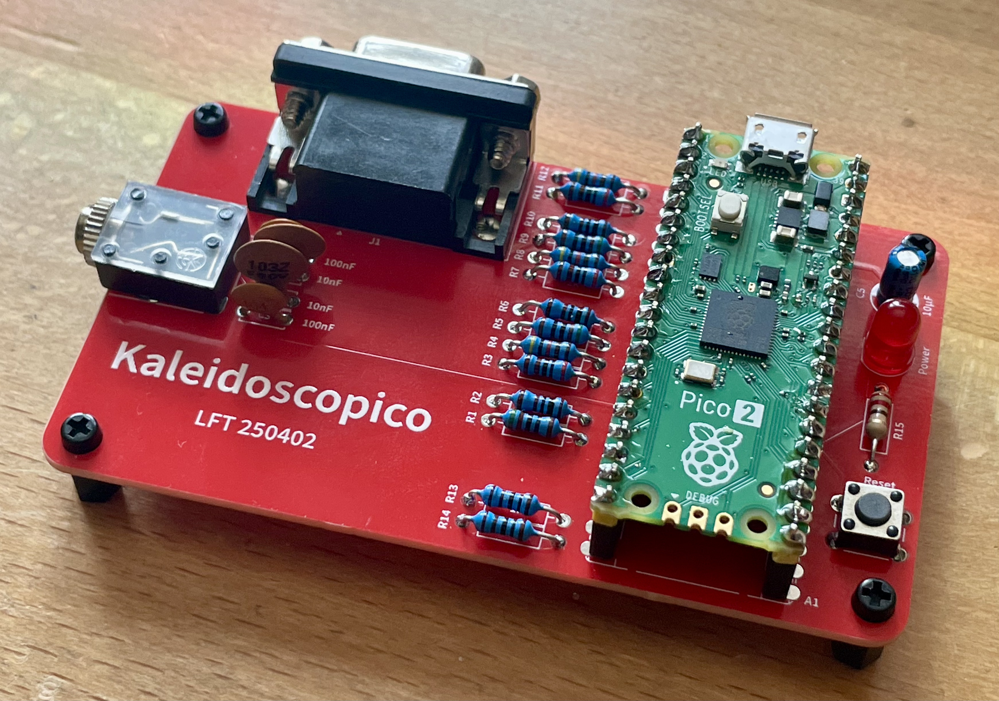

# Kaleidoscopico

[Kaleidoscopico](https://www.linusakesson.net/scene/kaleidoscopico/index.php) is a microcontroller demo by Linus Åkesson that runs on a Raspberry Pi Pico 2. It placed 2nd in the Wild compo at Revision 2025.

This is a small PCB so you can assemble the required hardware cleanly and easily.